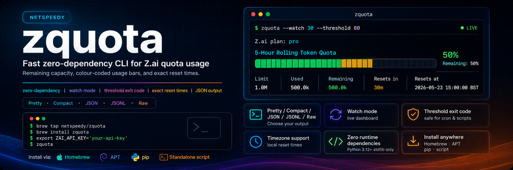

<p align="center">
  
</p>

<p align="center">
  <a href="https://github.com/netspeedy/zquota/actions/workflows/build-and-validate.yml"></a>
  <a href="https://github.com/netspeedy/zquota/releases"></a>
  <a href="https://netspeedy.github.io/zquota/"></a>
  <a href="https://www.python.org/"></a>
  <a href="LICENSE"></a>
  <a href="zquota.py"></a>
  <a href="https://buymeacoffee.com/soakes"></a>
</p>

**zquota** turns the Z.ai quota API into a clear terminal view — your current plan, colour-coded usage bars, and the exact reset time for every rolling window. It exists because the Z.ai usage charts don't make the five-hour rolling reset obvious enough when you're planning work.

- **Zero runtime dependencies** — runs on the Python 3.12+ standard library alone.
- **Five output modes** — human, compact, JSON, JSON Lines, and raw.
- **Built for automation** — watch mode for a live dashboard, plus a dedicated threshold exit code for cron and shell scripts.
- **Install anywhere** — Homebrew formula, signed APT repository, `pip`, or a single downloadable script.

> **Unofficial tool, not affiliated with [Z.ai](https://z.ai).**

### Quickstart

```bash
brew tap netspeedy/zquota
brew install zquota
export ZAI_API_KEY='your-api-key'
zquota
```

Prefer another install path? See [Installation](#installation) for `pip`, APT, source, and standalone script options.

**Quick links:** [Website & APT repo](https://netspeedy.github.io/zquota/) · [Releases](https://github.com/netspeedy/zquota/releases) · [Usage guide](docs/usage.md) · [Release flow](docs/release.md) · [License](LICENSE)

## Overview

Z.ai exposes quota information through an authenticated API endpoint. `zquota` turns that response into:

- the current Z.ai plan level
- the known quota windows, including the five-hour rolling token quota
- percentage used and percentage remaining
- limit, used, and remaining unit counts
- the exact reset time in your chosen timezone
- UTC reset timestamp and epoch milliseconds for machine-readable output

## Installation

**Requirements:** Python 3.12 or newer.

### Homebrew (macOS and Linux)

```bash
brew tap netspeedy/zquota
brew install zquota
```

> On recent Homebrew, new third-party taps require explicit trust. If installation is refused, run `brew trust netspeedy/zquota` once, then `brew install zquota`.

### Signed APT repository (Debian and Ubuntu)

```bash
sudo install -d -m 0755 /etc/apt/keyrings
curl -fsSL https://netspeedy.github.io/zquota/zquota-archive-keyring.gpg \
  | sudo tee /etc/apt/keyrings/zquota-archive-keyring.gpg >/dev/null

sudo tee /etc/apt/sources.list.d/zquota.sources >/dev/null <<'EOF'
Types: deb deb-src
URIs: https://netspeedy.github.io/zquota/
Suites: stable
Components: main
Signed-By: /etc/apt/keyrings/zquota-archive-keyring.gpg
EOF

sudo apt update
sudo apt install zquota
```

### pip

```bash
python3 -m pip install git+https://github.com/netspeedy/zquota.git
```

### Download the script

No install at all — just download and run:

```bash
mkdir -p ~/.local/bin
curl -fsSL https://raw.githubusercontent.com/netspeedy/zquota/main/zquota.py -o ~/.local/bin/zquota
chmod +x ~/.local/bin/zquota
```

Make sure `~/.local/bin` is on your `PATH`.

### Build from source

```bash
git clone https://github.com/netspeedy/zquota.git
cd zquota
python3 -m pip install .
```

## Configuration

Set your Z.ai API key in the environment:

```bash
export ZAI_API_KEY='your-api-key'
```

Supported environment variables:

| Variable | Required | Description | Default |
|---|:---:|---|---|
| `ZAI_API_KEY` | yes | Bearer token used to query the quota endpoint | none |
| `ZAI_API_URL` | no | Alternate quota endpoint, mainly useful for testing | `https://api.z.ai/api/monitor/usage/quota/limit` |
| `ZAI_TIMEZONE` | no | Timezone used for displayed reset times | `Europe/London` |

CLI flags take precedence over environment variables.

## Usage

Run the default terminal view:

```bash
zquota
```

Example output:

```text
  Z.ai plan: pro

  │  5-Hour Rolling Token Quota
  │
  │  [████████████░░░░░░░░░░░░] 50% used
  │  Remaining: 50%
  │  Limit:      1.0M
  │  Used:       500.0k
  │  Remaining: 500.0k
  │  Resets in:   30m
  │  Resets at:   2026-05-23 15:00:00 BST
  ──────────────────────────────────
```

Common flags — `-c`/`--compact`, `-j`/`--json`, `--jsonl`, `--raw`, `-z`/`--timezone`, `-w`/`--watch`, `-t`/`--threshold`:

```bash
zquota --compact                 # one line per quota
zquota --timezone America/New_York
zquota --watch 30                # live, refresh every 30s
zquota --threshold 80            # exit 2 if any quota is at/above 80%
```

## Output formats

| Format | Flag | Use case |
|---|---|---|
| Pretty | default | Human-readable terminal output |
| Compact | `--compact` | One line per quota |
| JSON | `--json` | Scripting, dashboards, and `jq` |
| JSON Lines | `--jsonl` | Logs and append-only collection |
| Raw | `--raw` | Debugging the upstream API response |

JSON output includes both local and UTC reset fields:

```bash
zquota --json | jq '.quotas[] | {quota: .name_compact, local: .resets_at, utc: .resets_at_utc}'
```

```json
{
  "quota": "5h-rolling",
  "local": "2026-05-23 15:00:00 BST",
  "utc": "2026-05-23T14:00:00Z"
}
```

## Exit codes

| Code | Meaning |
|---:|---|
| `0` | Success |
| `1` | Runtime or input error |
| `2` | Threshold exceeded when `--threshold` is set |

The separate threshold exit code makes it safe to distinguish quota pressure from a broken API key, network failure, or invalid response.

## Development

Create a local environment and install the development tools:

```bash
python3 -m venv .venv
. .venv/bin/activate
python3 -m pip install -e '.[dev]'
```

Run the local checks:

```bash
make fmt-check
make lint
make test
make smoke
make version-check
```

Format, build, and preview the website:

```bash
make fmt              # format with black
make build            # build a Python package
make website-build    # build the GitHub Pages site
```

## Project structure

```text
zquota/
├── zquota.py                 # CLI application
├── tests/                    # Stdlib unittest coverage
├── debian/                   # Debian package metadata
├── homebrew/                 # Homebrew formula template
├── docs/                     # Usage and release documentation
├── scripts/                  # Release helper scripts
├── .github/
│   ├── assets/website/       # GitHub Pages landing site
│   └── workflows/            # GitHub Actions release automation
├── AGENTS.md                 # Repository rules for coding agents
├── pyproject.toml            # Packaging and tool configuration
├── Makefile                  # Local validation shortcuts
├── LICENSE                   # MIT License
└── README.md                 # Project overview
```

## Contributing

Issues and pull requests are welcome at [netspeedy/zquota](https://github.com/netspeedy/zquota). The development commands above are the expected minimum validation before a change lands; see [AGENTS.md](AGENTS.md) for the full repository conventions. Releases are automated — see [docs/release.md](docs/release.md).

## License

Copyright © 2026 [Simon Oakes](https://github.com/soakes). Released under the [MIT License](LICENSE).

`zquota` is an unofficial community tool and is not affiliated with, endorsed by, or sponsored by [Z.ai](https://z.ai).
